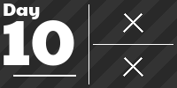
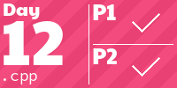

# AdventOfCode

This repository contains my solutions to the Advent of Code challenges (Which I started in 2024).
The challenges are solved using C++.

<!-- AOC TILES BEGIN -->
<h1 align="center">
  2024 - 22 ⭐ - C++
</h1>

<!-- AOC TILES END -->
